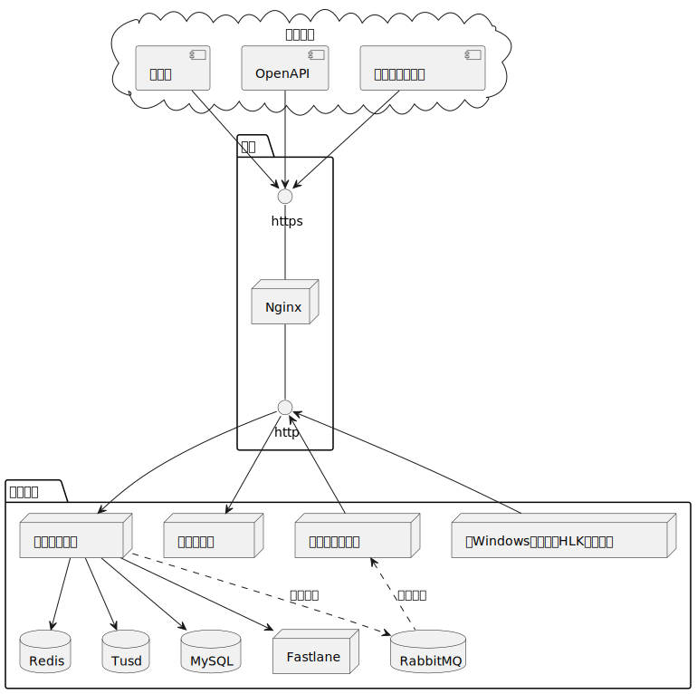

# 一、项目说明

本系统名为**数字证书签名及管理系统**，提供了日常工作生活中常见的操作系统平台（Windows、iOS、macOS、Android）的软件的自动化签名，
以及HLK测试、WHQL认证自动化。实现一套管理员便于管理，软件开发者易于使用，根据使用场景负荷可伸缩资源的管理系统。

### 实现的功能模块一览：
- 用户管理
  - 注册
  - 登录
  - 密码与个人信息修改
  - 连续登录失败限制登录
- 应用管理
  - 创建应用
  - 更新应用
  - 注销应用
- OpenAPI 凭证管理
  - 申请凭证
  - 更新凭证
  - 删除凭证
  - 续期凭证
  - 重置凭证密钥
- 签名管理
  - Android apk、aab文件和补丁签名
  - Windows PE文件签名
  - WHQL认证
  - HLK测试
  - iOS ipa文件签名
  - macOS pkg、dmg文件签名
  - 自动化签名程序
- 事件统计
  - 浏览应用事件
  - 浏览系统事件
- 待办管理
  - 证书即将过期提醒
  - 用户申请加入应用
  - 应用成员第一次使用签名
  - 应用申请绑定Apple账号
  - 应用申请注册Apple测试设备
- 后台管理
  - 用户查询与管理
  - 冻结解冻用户
  - 重置用户密码
  - 重置用户连续登录失败次数
  - 应用查询与导出
  - 公共证书管理
  - Android证书组织新增和删除
  - Windows公共证书上传、添加与删除
  - Apple公共证书申请、上传与删除
  - Apple测试设备管理
  - 系统统计图表
  - 各平台签名任务耗时统计折线图
  - 各平台签名成功率统计折线图
  - 各平台签名量统计折线图
  - 应用事件统计柱状图
  - 系统公告管理
- 证书管理
  - Android证书申请与删除
  - GooglePlay相关生成下载
  - 上传证书
  - 部署证书
  - 加密私钥
  - 升级签名密钥
  - Windows证书
  - 描述文件申请、更新与删除
  - Push证书申请
  - Apple BundleId申请
  - Apple BundleId能力的增减
  - Facebook密钥散列生成

### 模块简说

1. 用户管理。用户通过在本系统上注册获取账号，登录本系统后使用相
关服务。用户可以修改登录密码和头像等个人信息。
1. 应用管理。用户可以创建、注销和更新应用，在应用内使用证书申请
和软件签名等服务。
1. OpenAPI 凭证管理。OpenAPI 提供了企业内部员工需要在其特定的自
动化场景下使用本系统相关服务的方式。该模块方便用户管理请求凭证。
1. 签名管理。对软件的数字签名是本系统的核心诉求。签名功能包含对
平台各类型软件的签名，以及查看任务进展情况的签名任务列表。同时本系统
提供自动化签名程序，便于企业员工在其特定的自动化场景下使用。
1. 事件统计。每一个应用的操作事件进行收集统计，用户可浏览应用操
作事件，系统管理员可浏览所有操作事件。
1. 待办管理。每一个用户都有一个待办系统。待办系统便于用户更好地
使用本系统服务，提醒通知用户和处理审批单。
1. 后台管理。后台管理是本系统长期正常运行不可或缺的功能，是系统
管理员进行系统管理和控制的主要工具。系统管理员基于后台管理功能运营本
系统，包含了对用户的管理功能，系统中数据的查看与管理功能等。
1. 证书管理。数字证书的申请、签名使用是本系统的核心服务。对于不
同操作系统平台，证书管理有些许差异。

# 二、项目实现

### 系统部署和网络拓扑

### 服务器说明

1. 主后台服务器，主后台服务器可以有多台，具体数量可取决于使用场
景压力，运行于 Linux 系统，同其他后台服务器和客户端通信。
1. 网站服务器，主后台服务器不负责用户视图处理，有别于传统的 Java
MVC 开发模式，MVC 模式中主服务器不仅负责数据加工，同时负责视图渲染，
例如 JSP 技术。本系统采用前后端分离开发模型，以提高数据和视图复用效率，
也提高了开发效率和扩展性。网站服务器负责渲染视图返回给浏览器，浏览器
请求主后台服务器接口获取数据。网站服务器采用 nodejs 运行，Vue 代码库和
ElementPlus UI 代码库开发实现。
1. Windows 签名服务器，用于处理 Windows 签名任务，运行于 Windows
系统，调用 signtool.exe/winevsigner 完成签名逻辑。
1. Android 签名服务器，用于处理 Android 应用签名任务。使用 Linux 系
统运行，调用 apksigner/jarsigner 完成签名逻辑。
1. macOS 签名服务器，用于处理 pkg/dmg 应用签名任务。使用 macOS 系
统运行，使用 codesign 完成签名逻辑。
1. iOS 签名服务器，用于处理 ipa 签名任务，linux 系统运行，使用本系统
代码库 ipasigner 完成签名逻辑。
1. 中间件服务器，有消息队列 RabbitMQ，缓存服务器 Redis，数据库 MySQL，
对象存储 Tusd，皆使用 Linux 系统运行。
1. 反向代理服务器，采用 Nginx 技术实现，中转所有请求到主后台服务
的网络请求，负载均衡主后台服务资源。使用 Linux 系统运行。
1. HLK 测试服务器，搭建 HLK 测试集群需要多台 Windows 系统，一个
Controller 服务器关联多个 TestMachine 服务器，测试不同 Windows 系统版本
会有多套 Controller/TestMachines 集群。HLK 服务器负责 Windows 驱动程序
的测试，主要使用 PowerShell 调用 HLK Studio 类库完成测试操作，测试后生
成 hlkx 包文件。
1. Fastlane 服务器，运行 fastlane 程序，完成对 Apple Push 证书的申请
等操作。使用 Linux 系统运行。

### 代码库说明

1. 主后台服务器代码库命名为 backend，负责所有客户端的 HTTP 请求，
作为枢纽同其他服务器通信。同时，处理了同 Apple 后台接口通信完成 Bundle
申请等操作，调用 keytool 工具生成解析 Android 证书，运行定时任务逻辑，
以及同微软合作伙伴中心接口通信完成 WHQL 认证。
1. Android 签名服务器代码库命名为 androidsign，负责监听消费 Android
应用签名任务，内部调用 apksigner/jarsigner 程序对软件完成签名，通过 HTTP
协议请求 backend 获取任务信息、文件和更新任务签名结果。
1. iOS 签名服务器代码库命名为 iossign，负责消费 ipa 文件签名任务消息，
使用 ipasigner 程序完成签名，同上需同 backend 通信。
1. macOS 签名服务器代码库命名为 macsign，负责消费 pkg/dmg 签名任务
消息，使用 codesign 程序完成签名，同上需同 backend 通信。
1. Windows 签名服务器代码库命名为 winsign，负责消费 PE 和 hlkx 文件
签名消息，使用 signtool.exe 和 winevsigner 完成签名，同上需同 backend 通信。
1. HLK 测试机器中的 Windows Service 代码库命名为 hlk_manager，负责
对测试任务的调度处理：HTTP 请求 backend 获取任务，在 TestMachine 上安
装驱动并运行，在 Controller 上新建测试项目，执行测试（通过 PowerShell 调
用 HLK Studio 类库完成），处理测试交互（通过 Python 代码获取桌面对话框
信息），获取测试日志，打包测试结果 hlkx。同时负责对 Hyper-V 虚拟机的
开关机和回滚检查点。
1. Fastlane 服务器代码库命名为 fastlane，负责接收 backend 的 HTTP 请
求，运行 fastlane 命令并按需返回结果。
1. 公共依赖代码库命名为 common，包含通用共用的代码，供其他代码库
依赖使用。
